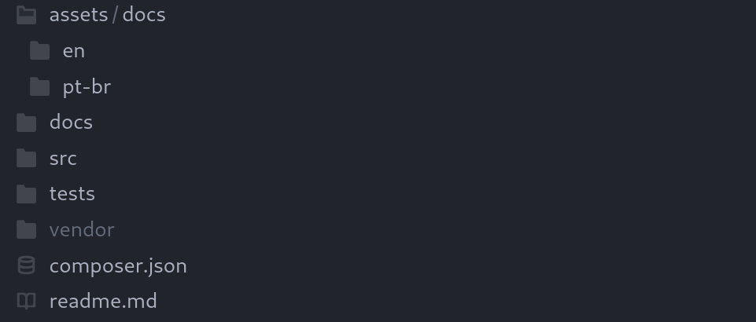

# How to use

[◂ Documentation index](index.md) | [Languages ▸](02-languages.md)
-- | --

## The interpreter

Docmap is an interpreter, which parses a documentation project in markdown.

In the process, the structure of directories and the contents of the files are analyzed in search of information that provides the way in which the menus should be designed.

## Installation

Docmap is used via the command line. For this to be possible, it is necessary to install the composer package as shown in the example below:

```bash
composer require iquety/docmap
```

## Execution

After installation, the script will be in `vendor/bin/docmap`, from where it can be used in any PHP project, invoking it as in the following example:

```bash
vendor/bin/docmap -s src-docs -d docs -r ../../readme.md -l pt-br
```

The above command means:

Part | Description
-- | --
vendor/bin/docmap | Invoking the command installed in composer's vendor/bin directory
-s src-docs | Specifies the path of the directory containing the markdown files with replacement tags
-d docs | Specifies the directory path where processed files will be saved
-r ../../readme.md | Specifies the location of the project's "presentation" file
-l pt-br | Determines the language for translating menu items. Currently it can be 'en' or 'pt-br'

## Automation

The best way to use Docmap in a project is to configure the necessary commands in a routine in the **composer.json** file so that it can be executed whenever an update is made to the documentation.

Suppose the project has the following directory structure:



Directory | Objective
-- | --
assets/docs | Directory containing the documents in their original state, containing replacement tags
assets/docs/en | Original documentation in English
assets/docs/pt-br | Original documentation in Portuguese
docs | Documentation generated by Docmap from previous directories
readme.md | Project readme file location

In this case, the project will make the documentation available in two languages. Each language is in a separate directory for further organization.

In the `composer.json` file, you can create a routine to remove the current documentation and regenerate it. See the example below, in the **scripts** section, the **docmap** routine:

```json
// composer.json

{
    "require": {
        "php": "^8.0.0",
        "ricardopedias/freep-docmap": "dev-main"
    },
    "scripts" : {
        "docmap" : [
            "rm -Rf docs/pt-br/*",
            "vendor/bin/docmap -s assets/docs/pt-br -d docs/pt-br -r leiame.md -l pt-br",
            "rm -Rf docs/en/*",
            "vendor/bin/docmap -s assets/docs/en -d docs/en"
        ]
    }
}
```

After this configuration, to redo the documentation in both languages, just invoke composer providing the name **docmap**:

```shell
composer docmap
```

[◂ Documentation index](index.md) | [Languages ▸](02-languages.md)
-- | --
