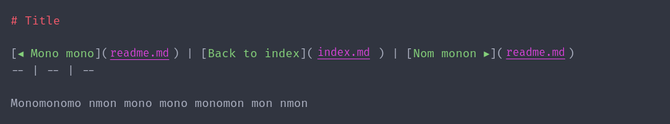

# Creating navigation menus

[◂ Using replacement tags](03-tags-replacement.md) | [Documentation index](index.md) | [Creating the summary ▸](05-tag-summary.md)
-- | -- | --

Para criar um ou mais menus de navegação em um arquivo markdown, basta usar a tag **page-nav**.

Exemplo de documentação com a tag declarada:

Exemplo de documentação com a tag já processada:

[◂ Using replacement tags](03-tags-replacement.md) | [Documentation index](index.md) | [Creating the summary ▸](05-tag-summary.md)
-- | -- | --
