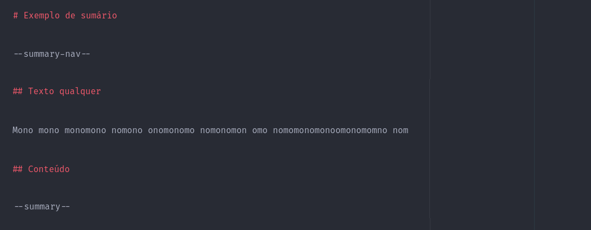
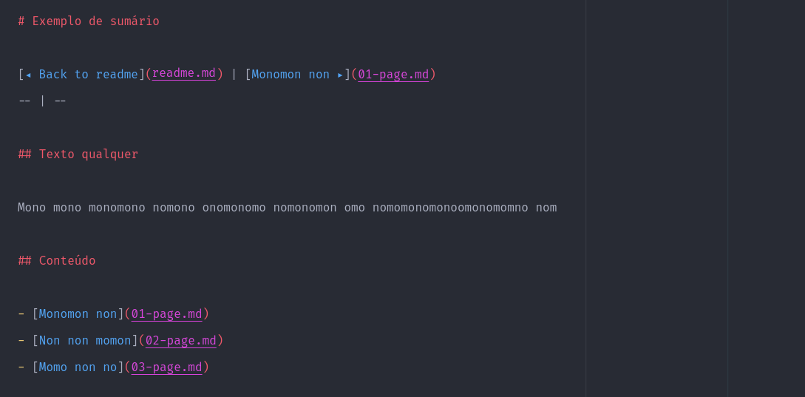

# Creating the table of contents navigation

[◂ Creating the summary](05-tag-summary.md) | [Documentation index](index.md) | [Creating translations ▸](07-creating-translations.md)
-- | -- | --

Unlike the page navigation menu, the table of contents has a more suitable menu, containing a link to the project's "readme.md" file.

To create this special kind of menu, just use the **summary-nav** tag.

Documentation example with the declared tag:

Example of documentation with the tag already processed:

[◂ Creating the summary](05-tag-summary.md) | [Documentation index](index.md) | [Creating translations ▸](07-creating-translations.md)
-- | -- | --
