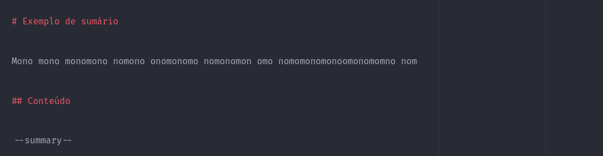
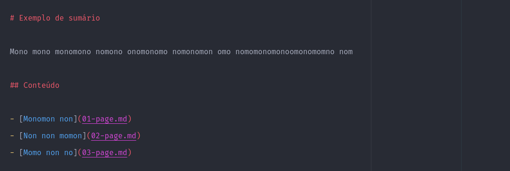

# Criando o sumário

[◂ Criando menus de navegação](04-tag-page-nav.md) | [Índice da documentação](indice.md) | [Criando a navegação do sumário ▸](06-tag-summary-nav.md)
-- | -- | --

Para criar um ou mais sumários em um arquivo markdown, basta usar a tag **summary**.

Exemplo de documentação com a tag declarada:

Exemplo de documentação com a tag já processada:

[◂ Criando menus de navegação](04-tag-page-nav.md) | [Índice da documentação](indice.md) | [Criando a navegação do sumário ▸](06-tag-summary-nav.md)
-- | -- | --
