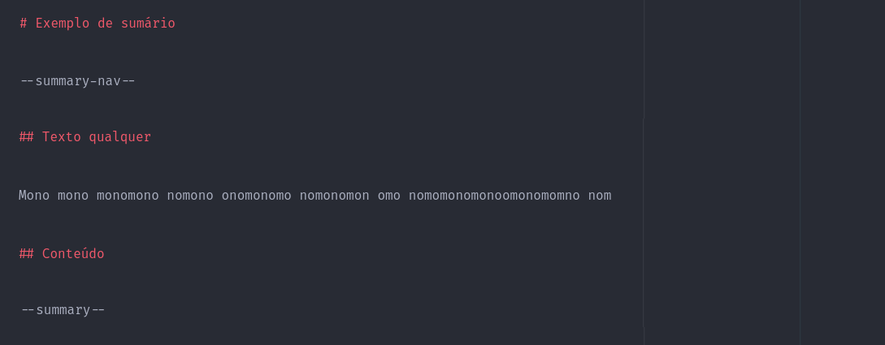
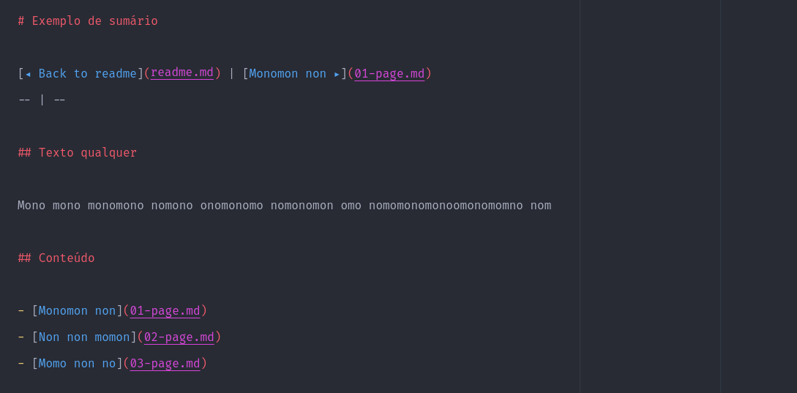

# Criando a navegação do sumário

[◂ Criando o sumário](05-tag-summary.md) | [Índice da documentação](indice.md) | [Criando traduções ▸](07-criando-traducoes.md)
-- | -- | --

Diferente do menu de navagação das páginas, o sumário possui um menu mais adequado, contendo um link para o arquivo "readme.md" do projeto.

Para criar esse tipo especial de menu, basta usar a tag **summary-nav**.

Exemplo de documentação com a tag declarada:

Exemplo de documentação com a tag já processada:

[◂ Criando o sumário](05-tag-summary.md) | [Índice da documentação](indice.md) | [Criando traduções ▸](07-criando-traducoes.md)
-- | -- | --
